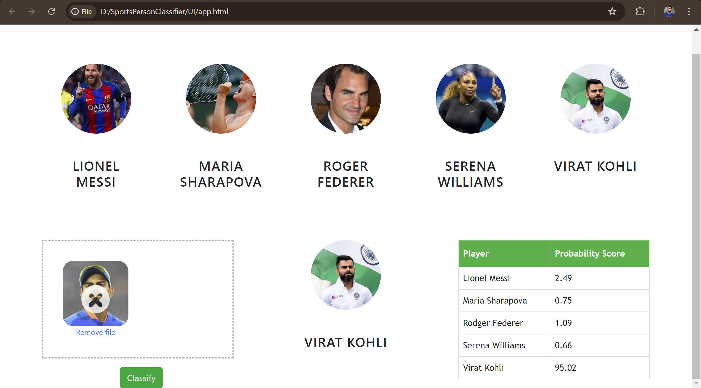

# Sports-Person-Classifier

In this data science and machine learning project, we classify sports personalities. We restrict classification to only 5 people,

- Lionel Messi
- Maria Sharapova
- Roger Federer
- Serena Williams
- Virat Kohli

  
## Folder Structure

- UI : This contains ui website code
- server: Python flask server
- model: Contains python notebook for model building
- images_dataset: Dataset used for our model training

Technologies used in this project,

- Python
- Numpy and OpenCV for data cleaning
- Matplotlib & Seaborn for data visualization
- Sklearn for model building
- Jupyter notebook, visual studio code and pycharm as IDE
- Python flask for http server
- HTML/CSS/Javascript for UI

## Acknowledgement

For this project I took inspiration from Codebasics [Youtube Playlist](https://www.youtube.com/playlist?list=PLeo1K3hjS3uvaRHZLl-jLovIjBP14QTXc)

